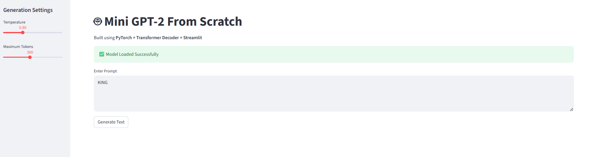

# Mini GPT-2 From Scratch

A complete implementation of a **GPT-2 inspired Decoder-Only Transformer** built entirely from scratch using **PyTorch**.

The model is trained on the **Tiny Shakespeare** dataset and generates Shakespeare-style text from user prompts. The project demonstrates the complete workflow of building a Transformer-based language model from scratch, including tokenization, Transformer implementation, model training, autoregressive text generation, and deployment using **Streamlit**.

This project was developed as part of the **Celebal Technologies AI Internship Program** to gain a practical understanding of Transformer architectures and language modeling.

---

## Live Demo

**Streamlit**

https://mini-gpt2-from-scratch-tnrl9jkbt2wezmulxcvkdn.streamlit.app/

**GitHub Repository**

https://github.com/sushantkurund/Mini-GPT2-From-Scratch

---

# Application Preview

## Home Page

---

## Generated Output

---

## Project Overview

Unlike using pre-trained models from Hugging Face, this project implements every major component of a GPT-style language model manually using PyTorch.

The implementation includes:

- Character-Level Tokenization
- Embedding Layers
- Positional Embeddings
- Multi-Head Self-Attention
- Transformer Decoder Blocks
- Feed Forward Networks
- Autoregressive Language Modeling
- Temperature-Based Sampling
- Model Training
- Interactive Streamlit Web Application

The objective of this project is to understand how modern Transformer-based language models work internally by implementing each component from scratch.

---

# Features

- GPT-2 Inspired Decoder-Only Transformer
- Character-Level Tokenizer
- Learned Positional Embeddings
- Multi-Head Self-Attention
- Feed Forward Networks
- Residual Connections
- Layer Normalization
- Temperature-Based Text Generation
- Interactive Streamlit Web Interface
- FastAPI REST API
- React + Vite Frontend
- Adjustable Temperature
- Adjustable Maximum Tokens
- Automatic Model Checkpoint Loading
- Responsive User Interface
